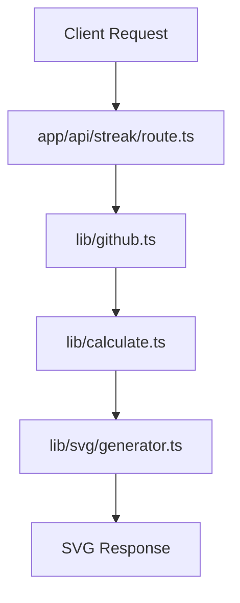

# Architecture

This document explains how a request flows through the SVG rendering pipeline.

## Request → Response Flow

## Layer Responsibilities

### API Layer

**File:** `app/api/streak/route.ts`

Receives incoming requests and handles request validation. It acts as the entry point for the SVG generation pipeline.

### GitHub Data Layer

**File:** `lib/github.ts`

Fetches contribution and activity data from GitHub APIs and prepares the required information.

### Calculation Layer

**File:** `lib/calculate.ts`

Processes fetched data and calculates statistics such as contribution streaks and related values.

### SVG Generation Layer

**File:** `lib/svg/generator.ts`

Converts processed data into SVG elements and generates the final visual output.

## Caching Strategy

Caching reduces repeated API requests and improves performance.

The system can cache GitHub responses and calculated results to:

- Reduce unnecessary API calls
- Improve response speed
- Reduce server load
- Prevent repeated processing for frequently requested data

## Summary

Pipeline flow:

1. Client sends request
2. API route receives request
3. GitHub data is fetched
4. Data calculations are performed
5. SVG is generated
6. Response is returned
